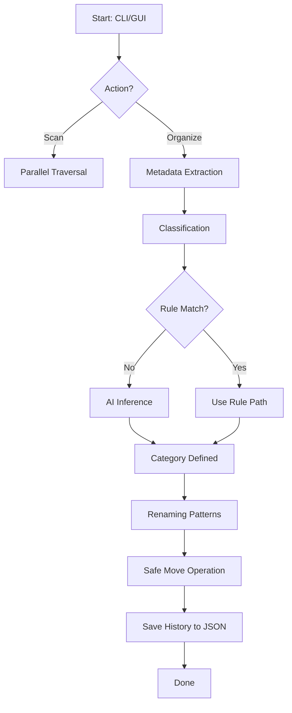

# 🚀 AI File Organizer: Smart Data Orchestration Engine

> **"A production-grade, AI-powered system designed to transform digital chaos into structured intelligence."**

Developed by **Syed Shaheer Hussain** | 2026 ©  
*Streamlining file management with the power of Rust, Machine Learning, and Deterministic Rules.*

## 🌟 Introduction

The **AI File Organizer** is a high-performance, cross-platform utility engineered to solve the "Digital Hoarding" crisis. Built with the memory safety and speed of **Rust**, this tool goes beyond simple extension sorting. It employs a **hybrid classification strategy**—combining deterministic JSON rules with OpenAI's Large Language Models (LLM) and local ONNX runtimes—to understand the *context* of your files.

Whether you're a photographer with thousands of RAW files, a developer with scattered repositories, or a professional managing finance documents, this engine automates the sorting, renaming, and deduplication process with surgical precision.

### 🏷️ Quick Tags
`#Rust` `#AI` `#MachineLearning` `#FileManagement` `#Automation` `#OpenAI` `#Deduplication` `#SafetyFirst`

## 🛠️ Tech Stack & Technologies

| Layer | Technologies |
| :--- | :--- |
| **Core Language** |  (v1.75+) |
| **Async Runtime** | `Tokio` (Full async I/O) |
| **Parallelism** | `Rayon` (Multi-threaded file scanning) |
| **Machine Learning** | `OpenAI API` (GPT-3.5/4), `ONNX Runtime` (Local Inference) |
| **UI Framework** | `egui` + `eframe` (Hardware accelerated GUI) |
| **Cryptography** | `BLAKE3` (Fastest hashing engine for duplicates) |
| **Metadata** | `kamadak-exif`, `pdf-extract`, `infer` |
| **Data Format** | `Serde` (JSON deserialization) |

## 📂 Project Structure

```text
ai_file_organizer/
├── .agent/              # AI Agent workspace state
├── config/              # Centralized configuration
│   └── default_rules.json # Dynamic classification rules
├── models/              # Local ONNX models (optional)
├── src/
│   ├── main.rs          # Entry point & Orchestrator
│   ├── cli.rs           # Clap-based command definitions
│   ├── gui.rs           # GUI implementation (egui)
│   ├── config.rs        # App settings & environment
│   ├── constants.rs     # Global constants & versioning
│   ├── models/
│   │   └── file_info.rs # Core data structures (FileInfo, Metadata)
│   └── organizer/       # Logic Engine
│       ├── mod.rs       # The Organizer Trait & Pipeline
│       ├── scanner.rs   # Parallel file traversal
│       ├── classifier.rs# Hybrid classification logic
│       ├── rules.rs     # Deterministic pattern matching
│       ├── ai.rs        # LLM/ONNX interface
│       ├── renamer.rs   # Safe IO & Collision handling
│       ├── duplicates.rs# BLAKE3 hash-based deduplication
│       ├── metadata.rs  # Deep file inspection (EXIP, PDF)
│       ├── undo.rs      # JSON-backed state reversal
│       ├── archives.rs  # Zip/Tar extraction
│       ├── watcher.rs   # Real-time 'Notify' service
│       └── utils.rs     # Formatting & Logic helpers
├── Cargo.toml           # Dependency manifest
└── README.md            # You are here!

```

## 🗺️ Flow Chart (Logical Pipeline)



## 💎 Core Features

1.  **Parallel Hashing**: Uses `Rayon` to hash large file sets in parallel, making duplicate detection near-instant.
2.  **Deterministic Rules**: Regex-based sorting for invoices, screenshots, and specific work files.
3.  **LLM Classification**: Sends file context to OpenAI to categorize files rules can't catch (e.g., "Personal Notes" vs "Code snippets").
4.  **Hardware-Accelerated GUI**: A dark-mode desktop app for those who prefer drag-and-drop over the terminal.
5.  **Infinite Undo**: Every "Organize" run creates a `.undo_history.json` snapshot. Revert any mistake instantly.
6.  **Real-time Watcher**: Monitor your Downloads folder; as soon as a file hits the folder, it is moved to its permanent home.
7.  **Deep Metadata Inspection**: Reads EXIF dates from photos and PDF metadata for smarter grouping.

## ⌨️ Command Reference

### 1. Installation

# Prerequisites: Install Rust (rustup.rs)

# Clone and build
```
git clone https://github.com/SyedShaheerHussain/AI-File-Organizer-Offline-CLI-GUI-

```
```
cd ai_file_organizer

```
```
cargo build --release

```

### 2. Scanning (The Discovery Phase)

Lists files and calculates potential savings.

```powershell
cargo run -- scan ./Downloads

```

### 3. Organizing (The Action Phase)

The heavy lifter. Moves files into categories.

# Standard rule-based organization
```
cargo run -- organize C:\Users\User\Downloads

```
# AI-powered organization (Requires OPENAI_API_KEY)
# $env:OPENAI_API_KEY="your_key"
```
cargo run -- organize ./folder --ai
```

# Dry run (Safety check)
```
cargo run -- organize ./folder --dry-run
```

### 4. Deduplication

Find and eliminate redundant data.

# Just list duplicates
```
cargo run -- duplicates ./MyPhotos

```

# Auto-remove duplicates (keeping newest)
```
cargo run -- duplicates ./MyPhotos --remove

```

### 5. Undo (The Safety Net)
```powershell
cargo run -- undo ./folder

```

### 6. Real-time Monitoring
```powershell
cargo run -- watch ./Downloads

```

### 7. Graphical Interface

```powershell
cargo run -- gui

```

## 🧠 The "Syed Shaheer" Implementation Story

### How I Learned & Realized This Project
I saw my "Downloads" folder becoming a graveyard of PDFs, screenshots, and zip files. Manual sorting was a 2-hour chore. I realized that **Rules** handle 80% of files, but **AI** is needed for the other 20% where naming is ambiguous. I chose **Rust** because handling thousands of I/O operations and high-speed hashing requires a language that doesn't have a Garbage Collector pause.

### What, When, Where, How, Why?
*   **What:** A hybrid deterministic/AI file manager.
*   **When:** Created in February 2026 to solve modern digital clutter.
*   **Where:** Runs on Windows, Linux, and macOS.
*   **How:** Built using `Tokio` for async and `egui` for the frontend.
*   **Why:** Because your time is better spent creating, not moving files.

## ⚠️ Cautions & Disclaimer

>[!caution]
> *   **Warning:** AI Mode sends file *names* and *metadata* to OpenAI. Do not use AI mode on folders containing sensitive/classified filename data if you do not want it sent to an external API.
> *   **Caution:** Duplicate removal is permanent (unless you use a Recycle Bin wrapper). Always perform a `--dry-run` first.
> *   **Disclaimer:** This software is provided "as is". While we have implemented an Undo system, I recommend backing up mission-critical data before massive organization operations.

## 🚀 Future Enhancements

- [ ] **OCR Integration**: Read text *inside* images to categorize them.
- [ ] **Cloud Connectors**: Organize files directly in Google Drive/Dropbox.
- [ ] **Perceptual Hashing**: Detect "similar" images, not just identical ones.
- [ ] **Mobile Port**: A companion app for Android/iOS.

## ⭐ Support & Engagement

If you find this repository useful or insightful, please consider:

- ⭐ Starring the repository
- 🔁 Sharing it within your network
- 👤 Following my GitHub profile for future projects and updates

Your support helps drive continued innovation and open-source contributions.

— Syed Shaheer Hussain

[](https://github.com/SyedShaheerHussain)


## 📝 Important Notes

>[!important]
> *   **Custom Rules**: Edit `config/default_rules.json` to add your own regex.
> *   **Performance**: For folders with >100k files, use the CLI for maximum speed.
> *   **Privacy**: Rule-based mode is 100% offline.

**Developed with ❤️ by Syed Shaheer Hussain**  
*Building the future of Desktop Automation.*

**License:** MIT | **Version:** 0.1.0-alpha  
© 2026 Syed Shaheer Hussain. All Rights Reserved.
